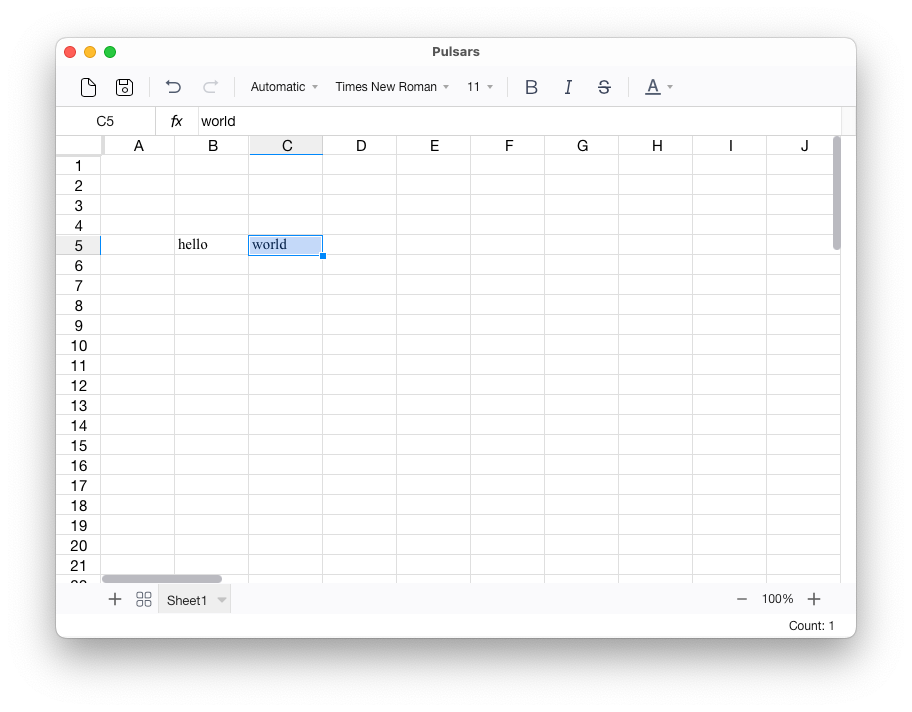

# Pulsars

A Tauri-based spreadsheet

The following cool libraries made it possible to build **Pulsars** 🚀:

- [fortune-sheet](https://github.com/ruilisi/fortune-sheet): JS library for spreadsheet interface
- [umya-spreadsheet](https://github.com/MathNya/umya-spreadsheet): Rust library that takes care reading and writing xlsx files

## Author

- [Ronie Martinez](mailto:ronmarti18@gmail.com)

## Attribution

- <a href="https://www.flaticon.com/free-icons/miscellaneous" title="miscellaneous icons">Miscellaneous icons created by Freepik - Flaticon</a>
